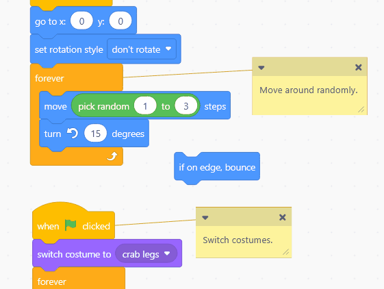

# ClickLock Indicator

A lightweight system tray app that provides visual and audio feedback for Windows ClickLock.



## Why?

Windows ClickLock lets you hold the left mouse button to "latch" it, so you can drag without holding the button down. Useful for accessibility, or just for comfort. 

The problem: there's no built-in indicator, so you often can't tell whether the button is held down or not, or find yourself either triggering it by accident when you don't mean to, or thinking it should be locked when it isn't. 

This app adds a tray icon and an optional cursor overlay so the state is always visible, with optional 'click' sounds for audio feedback. 

## Requirements

- Windows 10 or 11
- .NET Framework 4.7.2 (pre-installed on all modern Windows)
- ClickLock enabled in Windows settings
  (Settings → Accessibility → Mouse → Click lock, or search for "Lock mouse button on long click")

## Usage

1. Grab the latest release from the [Releases](../../releases) page
2. Unzip and put the folder anywhere you like — it's a portable app
3. Run `ClickLockIndicator.exe`
4. If Windows SmartScreen warns you, click **More info → Run anyway**

The app appears only in the system tray (no window).

**Tray icon:**
- Grey with small dot = idle
- Blue filled = ClickLock is currently locked

**Right-click menu:**
- **Start with Windows** — adds/removes the app from HKCU registry Run key.
  If you move the exe after enabling this, toggle it off and on again to update the path.
- **Sound** — plays a system sound on lock/unlock
- **Overlay** — choose the cursor overlay style:
  - *None* — no overlay
  - *Ring* — a ring fades in around the cursor when locked
  - *Arc (charging)* — an arc sweeps in from the halfway point of the hold time,
    completes when locked, and stays visible until released

## Overlay behaviour

The overlay only appears after you have held the left button for 50% of your configured
ClickLock time. This means normal clicks produce no visual noise.

- **Charging:** amber arc sweeps clockwise
- **Locked:** arc turns blue and stays solid; tray icon turns blue
- **Released:** overlay disappears immediately

## Defaults

| Setting | Default |
|---|---|
| Sound | Off |
| Overlay | Arc (charging) |
| Start with Windows | Off |

## Notes

- The app reads your ClickLock hold time live from Windows, so changes in Mouse settings
  take effect immediately without restarting the app.
- No installation, no admin rights required.
- All settings stored in `settings.json` alongside the exe.

## Building

You need the .NET SDK (any recent version, e.g. 6+):

```
dotnet build -c Release
```

Output will be in `bin\Release\net472\ClickLockIndicator.exe`

The exe is standalone — copy it anywhere. Settings are stored in `settings.json`
next to the exe, so keep them together if you move it.

## How it works

Windows provides the ClickLock hold threshold via `SystemParametersInfo` (`SPI_GETMOUSECLICKLOCKTIME`), but **has no API to query whether the button is currently latched**. The app therefore shadows Windows' own logic: a low-level mouse hook times how long the left button is held, compares it to the threshold, and infers lock/unlock state from the event sequence. If that state machine drifts out of sync with Windows, the indicator will be wrong — so it has to replicate Windows' rules exactly.

## AI disclosure

This app was built with [Claude Code](https://claude.ai/code) with human direction and testing. The AutoHotkey scripts in this repo (`click_lock_sound.ahk`, `click_lock_text.ahk`) served as the original reference implementation, but Claude suggested and implemented richer UI feedback made possible by
the move to a native Windows application.
